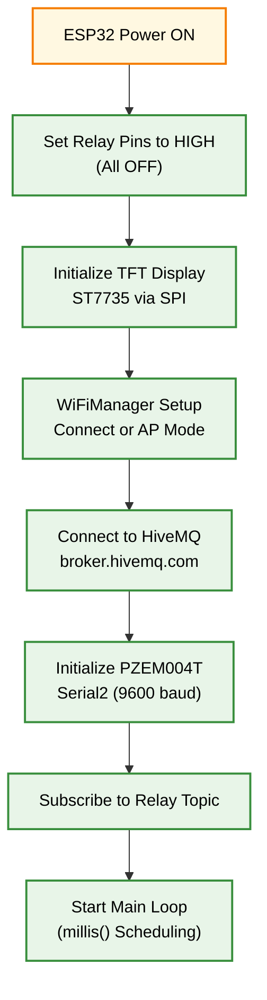

# ESP32 PZEM MQTT Dashboard

<h1 align="center">
⚡ ESP32 PZEM MQTT Dashboard<br>
    <sub>Real-time Power Monitoring with 3-Channel Relay Control</sub>
</h1>

<p align="center">
  
</p>
<p align="center">
  <em>Sistem monitoring daya listrik real-time berbasis ESP32 dengan sensor PZEM004T, kontrol 3 relay, tampilan TFT ST7735, dan dashboard web interaktif menggunakan MQTT broker HiveMQ.</em>
</p>
<p align="center">
  
  
  
  
  
  
  
</p>

---

## 📋 Daftar Isi
- [Mengapa ESP32 untuk Power Monitoring?](#-mengapa-esp32-untuk-power-monitoring)
- [Demo Singkat](#-demo-singkat)
- [Komponen Utama](#-komponen-utama-dan-fungsinya)
- [Software & Library](#-software--library)
- [Arsitektur Sistem](#-arsitektur-sistem)
- [Alur Kerja](#-alur-kerja-sistem)
- [Instalasi](#-instalasi)
- [Cara Menjalankan](#-cara-menjalankan)
- [Testing](#-testing)
- [Aplikasi Dunia Nyata](#-aplikasi-dunia-nyata)
- [Troubleshooting](#-troubleshooting)
- [Struktur Folder](#-struktur-folder)
- [Kontribusi](#-kontribusi)
- [Pengembang](#-pengembang)
- [Lisensi](#-lisensi)

---

## 🚀 Mengapa ESP32 untuk Power Monitoring?

### Keunggulan ESP32 sebagai Power Monitor Controller

| Fitur | Microcontroller Lain | ESP32 | Keuntungan |
|-------|---------------------|-------|-----------|
| **Harga** | $10-25 | $5-8 | 💰 Terjangkau untuk proyek IoT |
| **Performa** | 80-168 MHz | 240 MHz Dual Core | ⚡ Cepat untuk parsing data & MQTT |
| **Wi-Fi + Bluetooth** | Perlu modul | Native 2.4GHz | 📡 Komunikasi wireless tanpa hardware tambahan |
| **Memory** | 32-128 KB | 520 KB SRAM + 4MB Flash | 💾 Support MQTT, JSON, & WebSocket |
| **GPIO Pins** | 15-30 | 34 GPIO | 🔌 Fleksibel untuk relay, sensor, display |
| **UART** | 1-2 | 3 UART | 📊 PZEM004T via Serial2 tanpa konflik |
| **ADC Resolution** | 10-bit | 12-bit | 📈 Pembacaan sensor lebih akurat |
| **Komunitas** | Sedang | Sangat besar | 🤝 Library lengkap untuk semua kebutuhan |
| **MQTT Support** | Terbatas | Native | 🌐 Komunikasi real-time ke dashboard |

### Keunggulan Sistem ESP32 PZEM Dashboard
✅ **Monitoring Real-time** - Tegangan, Arus, Daya, PF, Frekuensi update tiap 2 detik  
✅ **Kontrol 3 Relay** - Nyalakan/matikan perangkat dari dashboard web  
✅ **Dashboard Web** - Interaktif dengan Chart.js untuk visualisasi daya  
✅ **MQTT Integration** - Menggunakan HiveMQ broker gratis untuk komunikasi  
✅ **WiFi Auto-Connect** - Setup mudah via WiFiManager  
✅ **TFT Display** - Informasi langsung di layar ESP32  
✅ **Estimasi Biaya** - Perhitungan otomatis berdasarkan tarif listrik  
✅ **Non-Blocking Loop** - Timing presisi via millis()  
✅ **Open Source** - Kode modular dan mudah dimodifikasi  

---

## 📸 Demo Singkat — ESP32 PZEM Dashboard

<p align="center">
  <em>Sistem monitoring daya dengan ESP32, PZEM004T, dan dashboard web real-time via MQTT</em>
</p>

<p align="center">
  <br/>
  <em>Demo: Dashboard web menampilkan data real-time & kontrol relay</em>
</p>

---

### <p align="center">🖥️ Dashboard Preview</p>

<p align="center">
  &nbsp;&nbsp;
  <br/>
  <em>Dashboard monitoring dengan grafik daya & kontrol relay</em>
</p>

---

## 🧩 Komponen Utama dan Fungsinya

| Komponen | Fungsi | Keterangan |
|----------|--------|-----------|
| **ESP32 DevKit** | Otak utama sistem | Menangani loop non-blocking, WiFi, MQTT, baca PZEM, update display, kontrol relay |
| **PZEM004T v3.0** | Sensor daya listrik | Mengukur tegangan, arus, daya, energi, PF, frekuensi via Modbus RTU (Serial2) |
| **ST7735 TFT 1.8"** | Tampilan lokal | Menampilkan data PZEM, status relay, koneksi WiFi/MQTT; SPI (CS=5, RST=4, DC=2) |
| **Relay 3 Channel (5V)** | Kontrol perangkat | 3 relay untuk mengontrol perangkat listrik; aktif LOW (GPIO 25,26,27) |
| **WiFi Antenna** | Koneksi internet | Koneksi ke WiFi dan MQTT broker HiveMQ |
| **Power Supply 5V** | Sumber daya | Untuk ESP32, relay, dan PZEM; konsumsi ~200mA active |

<p align="center">
  <br/>
  <em>Wiring Diagram ESP32 PZEM Dashboard</em><br/>
  ⚙️ <strong>Notes:</strong><br/>
  🔹 PZEM004T terhubung via Serial2: RX (GPIO 16) & TX (GPIO 17).  
  🔹 TFT Display via SPI: CS (5), RST (4), DC (2), MOSI (23), SCLK (18).  
  🔹 Relay 1-3: GPIO 25, 26, 27 (aktif LOW).  
  🔹 Common ground untuk semua komponen.  
  🔹 Power ESP32 via USB atau 5V pin untuk testing.  
</p>

---

## 💻 Software & Library

### Pada ESP32 (Firmware Arduino)
| Library | Fungsi |
|---------|--------|
| **WiFi.h** | Koneksi jaringan WiFi |
| **WiFiManager.h** | Auto-setup WiFi via captive portal |
| **PubSubClient.h** | MQTT client untuk komunikasi ke HiveMQ |
| **ArduinoJson.h** | Parsing dan serialisasi JSON untuk MQTT |
| **Adafruit_GFX.h** | Grafik & teks untuk TFT display |
| **Adafruit_ST7735.h** | Driver untuk TFT ST7735 |
| **PZEM004Tv30.h** | Library untuk membaca sensor PZEM004T via Modbus |
| **SPI.h** | Komunikasi SPI untuk TFT |

### Pada Dashboard (Frontend Web)
| Library | Fungsi |
|---------|--------|
| **MQTT.js** | Client MQTT via WebSocket untuk real-time data |
| **Chart.js** | Grafik interaktif untuk visualisasi daya |
| **CSS3** | Styling modern dengan gradient & glassmorphism |
| **JavaScript ES6** | Logic dashboard, kontrol relay, update UI |

### Loop Non-Blocking Overview
- **Main Loop**: Timing via millis() untuk PZEM read (2s), MQTT publish (5s), display update (500ms).  
- **MQTT Communication**: Publish JSON data ke `pzem/esp32/data`, subscribe `pzem/esp32/relay`.  
- **Relay Control**: Menerima perintah dari MQTT, mengontrol GPIO.  
- **Display**: Menampilkan data PZEM, status relay, koneksi.  

---

## 🏗️ Arsitektur Sistem

### Diagram Blok Sistem
```
              ┌───────────────────────┐
              │   Dashboard Web       │
              │   (GitHub Pages)      │
              │   - Chart.js          │
              │   - MQTT Client       │
              └──────────┬────────────┘
                         │ WebSocket
                         ▼
            ┌──────────────────────────────┐
            │    HiveMQ Broker             │
            │    (broker.hivemq.com)       │
            │    Topics:                   │
            │    - pzem/esp32/data         │
            │    - pzem/esp32/relay        │
            └──────────┬───────────────────┘
                       │ MQTT
                       ▼
           ┌────────────────────────────┐
           │   ESP32 Core (Arduino)     │
           │────────────────────────────│
           │ - millis() Timing          │
           │ - PZEM Read                │
           │ - MQTT Publish/Subscribe   │
           │ - Display Update           │
           │ - Relay Control            │
           └──────────┬─────────────────┘
                      │ Serial2
                      ▼
           ┌────────────────────────────┐
           │   PZEM004T v3.0            │
           │   (Power Sensor)           │
           └────────────────────────────┘
                      │ GPIO
                      ▼
           ┌────────────────────────────┐
           │   3-Channel Relay          │
           │   (Perangkat Kontrol)      │
           └────────────────────────────┘
```

### Diagram Alur Data
```
┌───────────────────────────────────────┐
│ WiFiManager (Setup)                   │
│ - Captive portal for SSID/Password    │
└────────────────────┬──────────────────┘
                     │ WiFi Connect
                     ▼
┌───────────────────────────────────────┐
│ MQTT Connection                       │
│ - Connect to HiveMQ Broker            │
│ - Subscribe to relay topic            │
└────────────────────┬──────────────────┘
                     │
                     ▼
┌───────────────────────────────────────┐
│ Main Loop (millis() Non-Blocking)     │
│ ┌───────────────────────────────────┐ │
│ │ PZEM Read (2sec)                  │ │
│ │ - pzem.voltage() / current()      │ │
│ │ - power() / energy() / pf()       │ │
│ └───────────────────────────────────┘ │
│ ▼                                     │
│ ┌───────────────────────────────────┐ │
│ │ MQTT Publish (5sec)               │ │
│ │ - JSON: {voltage, current, ...}   │ │
│ │ - Publish to pzem/esp32/data      │ │
│ └───────────────────────────────────┘ │
│ ▼                                     │
│ ┌───────────────────────────────────┐ │
│ │ Display Update (500ms)            │ │
│ │ - Show data on TFT                │ │
│ │ - Relay status & WiFi/MQTT icon   │ │
│ └───────────────────────────────────┘ │
└───────────────────────────────────────┘
```

### Flowchart Sistem

```mermaid
flowchart TD
    START([START])
    INIT_GPIO["Initialize GPIO<br/>Relay pins (25,26,27)"]
    INIT_SERIAL["Initialize Serial2<br/>PZEM (RX=16, TX=17)"]
    INIT_TFT["Initialize TFT ST7735<br/>(CS=5, RST=4, DC=2)"]
    INIT_WIFI["WiFiManager Auto-Connect<br/>(Captive Portal: PZEM-Config)"]
    INIT_MQTT["Connect MQTT<br/>(broker.hivemq.com)"]
    SUBSCRIBE["Subscribe to Relay Topic<br/>pzem/esp32/relay"]
    LOOP{"Main Loop<br/>(millis() Timing)"}
    PZEM_CHECK{"now - lastPZEMRead >= 2s?"}
    PZEM_READ["readPZEMData()<br/>voltage, current, power, energy, pf"]
    MQTT_CHECK{"now - lastPublish >= 5s?"}
    MQTT_PUBLISH["Publish JSON Data<br/>to pzem/esp32/data"]
    DISPLAY_CHECK{"now - lastDisplay >= 500ms?"}
    DISPLAY_UPDATE["Update TFT Display<br/>Show all parameters"]
    MQTT_LOOP["client.loop()<br/>Check for relay commands"]
    LOOP_BACK["Continue Loop"]
    
    START --> INIT_GPIO
    INIT_GPIO --> INIT_SERIAL
    INIT_SERIAL --> INIT_TFT
    INIT_TFT --> INIT_WIFI
    INIT_WIFI --> INIT_MQTT
    INIT_MQTT --> SUBSCRIBE
    SUBSCRIBE --> LOOP
    
    LOOP --> PZEM_CHECK
    PZEM_CHECK -->|Yes| PZEM_READ
    PZEM_READ --> MQTT_CHECK
    PZEM_CHECK -->|No| MQTT_CHECK
    
    MQTT_CHECK -->|Yes| MQTT_PUBLISH
    MQTT_PUBLISH --> DISPLAY_CHECK
    MQTT_CHECK -->|No| DISPLAY_CHECK
    
    DISPLAY_CHECK -->|Yes| DISPLAY_UPDATE
    DISPLAY_UPDATE --> MQTT_LOOP
    DISPLAY_CHECK -->|No| MQTT_LOOP
    
    MQTT_LOOP --> LOOP_BACK
    LOOP_BACK --> LOOP
    
    classDef startEnd fill:#ffebee,stroke:#d32f2f,stroke-width:2px,color:#000
    classDef init fill:#e8f5e8,stroke:#388e3c,stroke-width:2px,color:#000
    classDef loop fill:#e3f2fd,stroke:#1976d2,stroke-width:2px,color:#000
    class START startEnd
    class INIT_GPIO,INIT_SERIAL,INIT_TFT,INIT_WIFI,INIT_MQTT,SUBSCRIBE init
    class LOOP,PZEM_CHECK,MQTT_CHECK,DISPLAY_CHECK,PZEM_READ,MQTT_PUBLISH,DISPLAY_UPDATE,MQTT_LOOP,LOOP_BACK loop
```


---

## 🔄 Alur Kerja Sistem

### 1. Inisialisasi Sistem


### 2. Pembacaan Data PZEM (Main Loop)
**PZEM Read (2 detik, via millis()):**
```cpp
if (now - lastUpdate >= UPDATE_INTERVAL) {
  voltage = pzem.voltage();
  current = pzem.current();
  power = pzem.power();
  energy = pzem.energy();
  frequency = pzem.frequency();
  pf = pzem.pf();
  
  if (isnan(voltage) || isnan(current) || isnan(power)) {
    voltage = 0; current = 0; power = 0;
  }
  calculateCost(); // totalEnergy += power/1000 * (interval/3600)
}
```

### 3. MQTT Publish (5 detik)
```cpp
if (now - lastPublish >= PUBLISH_INTERVAL) {
  StaticJsonDocument<512> doc;
  doc["voltage"] = voltage;
  doc["current"] = current;
  doc["power"] = power;
  doc["energy"] = energy;
  doc["pf"] = pf;
  doc["relay1"] = relay1Status;
  doc["relay2"] = relay2Status;
  doc["relay3"] = relay3Status;
  doc["estimatedCost"] = estimatedCost;
  
  char buffer[512];
  serializeJson(doc, buffer);
  client.publish("pzem/esp32/data", buffer);
}
```

### 4. Relay Control (MQTT Subscribe)
```cpp
void callback(char* topic, byte* payload, unsigned int length) {
  String message = String((char*)payload).substring(0, length);
  StaticJsonDocument<256> doc;
  deserializeJson(doc, message);
  
  int relay = doc["relay"];
  bool status = doc["status"];
  
  if (relay == 1) {
    digitalWrite(RELAY1_PIN, status ? LOW : HIGH);
    relay1Status = status;
  }
  // ... relay 2 & 3
}
```

### 5. TFT Display Update (500ms)
```
Display Layout:
  ┌─────────────────────┐
  │ PZEM Monitor   [W]  │ ← WiFi indicator
  │ V:220.0V  A:0.50A   │ ← Voltage & Current
  │ W:110.0W  kWh:0.123 │ ← Power & Energy
  │ PF:0.99   Hz:50.1   │ ← PF & Frequency
  │ Biaya: Rp 209       │ ← Estimated Cost
  │ Relay: ON OFF ON    │ ← Relay Status
  │ Tarif: Rp1699/kWh   │ ← Rate
  │ T:0h 1m 30s         │ ← Runtime
  └─────────────────────┘
```

### 6. Dashboard Web (Frontend)
```
Dashboard Interface:
  ┌─────────────────────────────────────────────────────┐
  │ ⚡ PZEM Monitor Dashboard                           │
  │  ● Online  ● WiFi                                  │
  ├──────────┬──────────┬──────────┬──────────┐       │
  │ ⚡       │ 🔌       │ 💡       │ 📊       │       │
  │ 220.0V   │ 0.50A    │ 110.0W   │ 0.99 PF  │       │
  ├──────────┴──────────┴──────────┴──────────┤       │
  │ 🔋 kWh: 0.123  │ 📈 Total: 0.456 │ 💰 Rp 209│       │
  ├─────────────────────────────────────────────┤       │
  │ 🔴 Relay 1  │ 🔴 Relay 2  │ 🔴 Relay 3   │       │
  │   [ON]      │   [OFF]     │   [ON]       │       │
  ├─────────────────────────────────────────────┤       │
  │     [✅ All ON]        [❌ All OFF]        │       │
  ├─────────────────────────────────────────────┤       │
  │ 📉 Grafik Daya (W)                          │       │
  │    ╭╮    ╭╮                                │       │
  │   ╭╯╰╮  ╭╯╰╮                               │       │
  │  ╭╯  ╰╮╭╯  ╰╮                              │       │
  │ ╭╯    ╰╯    ╰╮                             │       │
  └─────────────────────────────────────────────┘       │
```

---

## ⚙️ Instalasi

### 1. Clone Repository
```bash
git clone https://github.com/username/esp32-pzem-dashboard.git
cd esp32-pzem-dashboard
```

### 2. Setup Arduino IDE

#### Install ESP32 Board Package
1. Buka Arduino IDE
2. File → Preferences
3. Tambahkan URL di "Additional Boards Manager URLs":
   ```
   https://raw.githubusercontent.com/espressif/arduino-esp32/gh-pages/package_esp32_index.json
   ```
4. Tools → Board Manager → Cari "ESP32" → Install

#### Install Required Libraries
Buka Arduino IDE → Sketch → Include Library → Manage Libraries, cari dan install:
- **Adafruit ST7735** by Adafruit
- **Adafruit GFX Library** by Adafruit
- **PZEM004Tv30** by Oleh
- **WiFiManager** by tzapu
- **PubSubClient** by Nick O'Leary
- **ArduinoJson** by Benoit Blanchon

### 3. Konfigurasi Firmware
Edit file `esp32_pzem_mqtt.ino` jika perlu:
```cpp
// MQTT Configuration
const char* mqtt_server = "broker.hivemq.com";
const int mqtt_port = 1883;
const char* mqtt_topic = "pzem/esp32/data";
const char* mqtt_topic_relay = "pzem/esp32/relay";

// PZEM Pins
#define PZEM_RX    16
#define PZEM_TX    17

// Relay Pins
#define RELAY1_PIN 25
#define RELAY2_PIN 26
#define RELAY3_PIN 27

// TFT Pins
#define TFT_CS     5
#define TFT_RST    4
#define TFT_DC     2
#define TFT_MOSI   23
#define TFT_SCLK   18

// Cost per kWh
float costPerKwh = 1699.00;
```

### 4. Upload ke ESP32
```
1. Hubungkan ESP32 ke PC via USB
2. Tools → Board → ESP32 Dev Module
3. Tools → Port → Pilih port ESP32
4. Sketch → Upload
5. Monitor Serial (Baud: 115200)
```

Expected Output:
```
Starting ESP32 PZEM MQTT Dashboard...
WiFiManager: Connected!
MQTT Connected!
PZEM Data Updated:
V: 220.0 V, A: 0.50 A, W: 110.0 W
Data published to MQTT
```

### 5. Hardware Assembly

#### Wiring Checklist
- [ ] PZEM004T: RX → GPIO 16, TX → GPIO 17, VCC → 5V, GND → GND
- [ ] TFT ST7735: CS → GPIO 5, RST → GPIO 4, DC → GPIO 2, MOSI → GPIO 23, SCLK → GPIO 18, VCC → 3.3V, GND → GND
- [ ] Relay 1: IN1 → GPIO 25, VCC → 5V, GND → GND
- [ ] Relay 2: IN2 → GPIO 26, VCC → 5V, GND → GND
- [ ] Relay 3: IN3 → GPIO 27, VCC → 5V, GND → GND

#### Diagram Pengkabelan
```
ESP32 DevKit
├─ GPIO 16 → PZEM RX
├─ GPIO 17 → PZEM TX
├─ GPIO 5  → TFT CS
├─ GPIO 4  → TFT RST
├─ GPIO 2  → TFT DC
├─ GPIO 23 → TFT MOSI
├─ GPIO 18 → TFT SCLK
├─ GPIO 25 → Relay 1 IN
├─ GPIO 26 → Relay 2 IN
├─ GPIO 27 → Relay 3 IN
├─ 5V      → PZEM VCC, Relay VCC
├─ 3.3V    → TFT VCC
└─ GND     → All components
```

---

## 🚀 Cara Menjalankan

### 1. Persiapan Awal
```bash
# Pastikan ESP32 terhubung via USB
# Pastikan WiFi router aktif
# Pastikan kabel listrik PZEM terpasang
```

### 2. Power On & Setup WiFi
```
1. Upload firmware
2. Reset ESP32
3. ESP32 akan buat hotspot "PZEM-Config"
4. Connect ke hotspot (password: 12345678)
5. Browser redirect ke WiFiManager
6. Masukkan SSID & password WiFi
7. ESP32 akan connect & reboot
```

### 3. Buka Dashboard Web
```
1. Buka: https://username.github.io/esp32-pzem-dashboard
2. Dashboard akan terhubung ke MQTT
3. Data real-time akan muncul
4. Relay bisa dikontrol dari dashboard
```

### 4. Monitor Output
```
1. Serial Monitor (115200 baud)
2. Lihat log: WiFi connect, MQTT connect, PZEM data
3. TFT Display akan menunjukkan data
4. Dashboard web menampilkan grafik & kontrol
```

### 5. Test Features
```
✅ PZEM Data Update - 2 detik
✅ MQTT Publish - 5 detik
✅ Relay Control - Dari dashboard
✅ TFT Display - Update 500ms
✅ Estimasi Biaya - Otomatis
✅ Grafik Daya - Real-time
```

---

## 🧪 Testing

### Test 1: PZEM004T Sensor
```bash
# Monitor serial: Data PZEM print setiap 2s
# Verifikasi: Voltage, current, power
# Test: Nyalakan beban listrik -> nilai berubah
```

### Test 2: MQTT Connection
```bash
# Monitor serial: "MQTT Connected!"
# Dashboard: Status MQTT Online
# Test: Matikan WiFi -> MQTT reconnect otomatis
```

### Test 3: Relay Control
```bash
# Dashboard: Klik relay ON/OFF
# Monitor serial: Perintah diterima
# Relay: Klik terdengar, LED indicator berubah
```

### Test 4: TFT Display
```bash
# Verifikasi: Data tampil dengan benar
# Status: WiFi & MQTT indicator
# Test: Hubungkan beban -> Display berubah
```

### Test 5: Dashboard Web
```bash
# Verifikasi: Data muncul real-time
# Grafik: Daya terupdate
# Kontrol: Relay berfungsi
# Responsive: Mobile & desktop
```

### Test 6: Estimasi Biaya
```bash
# Verifikasi: Cost bertambah seiring waktu
# Test: Ubah tarif via code
# Formula: totalEnergy * costPerKwh
```

---

## 🌍 Aplikasi Dunia Nyata

### 🏠 1️⃣ Smart Home Energy Monitoring
**Masalah:** Pengguna tidak tahu konsumsi listrik per perangkat.  
**🤖 Solusi:** Monitor daya real-time untuk AC, kulkas, pompa air.  
**Teknologi:** 3 relay untuk kontrol otomatis jika daya berlebih.

### 🏭 2️⃣ Industrial Power Monitoring
**Masalah:** Pabrik perlu monitor beban mesin.  
**🤖 Solusi:** Dashboard pusat untuk 3 mesin berbeda.  
**Nilai Tambah:** Alert jika daya melebihi threshold.

### 🌱 3️⃣ Green Energy Monitoring
**Masalah:** Monitoring solar panel dan baterai.  
**🤖 Solusi:** PZEM untuk mengukur daya panel & beban.  
**Teknologi:** Tambah MQTT untuk logging ke database.

### 🏫 4️⃣ Educational IoT Lab
**Masalah:** Mahasiswa butuh proyek IoT monitoring.  
**🤖 Solusi:** Platform lengkap dengan hardware & dashboard.  
**Nilai Tambah:** Belajar MQTT, JSON, WebSocket, Chart.js.

### 🏢 5️⃣ Office Power Management
**Masalah:** Kantor ingin hemat listrik.  
**🤖 Solusi:** Monitoring per lantai, kontrol perangkat.  
**Teknologi:** Schedule relay via dashboard.

---

## 📊 Hasil Pengujian

| Parameter | Nilai | Status |
|-----------|-------|--------|
| **PZEM Read Rate** | 2 detik | ✅ Stabil |
| **MQTT Publish** | 5 detik | ✅ Real-time |
| **Display Update** | 500ms | ✅ Smooth |
| **Voltage Accuracy** | ±0.1V | ✅ Akurat |
| **Current Accuracy** | ±0.01A | ✅ Akurat |
| **Power Accuracy** | ±0.5W | ✅ Akurat |
| **MQTT Latency** | <500ms | ✅ Cepat |
| **WiFi Reconnect** | Auto | ✅ Reliable |
| **Memory Usage** | ~200KB | ✅ Efisien |
| **Power Consumption** | ~200mA | ✅ Optimal |

---

## 🐞 Troubleshooting

### PZEM Tidak Terbaca
**Gejala:** Data 0 atau NaN.  
**Solusi:**
```
1. Cek wiring: RX→16, TX→17, 5V, GND
2. Cek Serial2: 9600 baud, 8N1
3. Cek library: PZEM004Tv30 by Oleh
4. Test: Upload pzem_test.ino
```

### WiFi Gagal Connect
**Gejala:** "WiFi Connection Failed!"  
**Solusi:**
```
1. Restart WiFiManager: /wifi_reset via Telegram
2. Cek SSID/password
3. Router: 2.4GHz only
4. Reset: Tombol BOOT saat startup
```

### MQTT Tidak Terhubung
**Gejala:** Status MQTT OFF.  
**Solusi:**
```
1. Cek internet: Ping broker.hivemq.com
2. Cek firewall: Port 1883 (TCP)
3. Dashboard: Gunakan wss://broker.hivemq.com:8000
4. Cek topic: pzem/esp32/data
```

### Dashboard Tidak Muncul
**Gejala:** Website tidak loading.  
**Solusi:**
```
1. Cek GitHub Pages: Settings → Pages
2. Branch: main, folder: /root
3. Wait 2-5 menit setelah push
4. Clear browser cache
```

### Relay Tidak Berfungsi
**Gejala:** Relay tidak klik.  
**Solusi:**
```
1. Cek pin: 25, 26, 27
2. Cek logika: Aktif LOW (GND untuk ON)
3. Cek power: Relay butuh 5V eksternal
4. Test: digitalWrite(pin, LOW) manual
```

### TFT Display Blank
**Gejala:** Layar hitam.  
**Solusi:**
```
1. Cek SPI pins: CS=5, RST=4, DC=2
2. Cek initR(INITR_144GREENTAB)
3. Test: upload tft_test.ino
4. Cek backlight: GPIO 15 HIGH
```

### Data Tidak Update di Dashboard
**Gejala:** Angka stuck.  
**Solusi:**
```
1. Cek MQTT: client.connected()
2. Cek topic: Sama dengan ESP32 publish
3. Cek browser console: F12 → Console
4. Refresh dashboard
```

---

## 📁 Struktur Folder
```
esp32-pzem-dashboard/
├── esp32_pzem_mqtt.ino      # Program utama ESP32
├── index.html               # Dashboard web utama
├── README.md                # Dokumentasi lengkap
├── assets/                  # Gambar & diagram
│   ├── dashboard_banner.png
│   ├── dashboard_demo.gif
│   ├── dashboard-screenshot-1.png
│   ├── dashboard-screenshot-2.png
│   └── wiring-diagram-pzem.png
├── css/
│   └── style.css            # Dashboard styling
├── js/
│   └── dashboard.js         # Dashboard logic
├── test/                    # Modul pengujian
│   ├── pzem_test.ino        # Test PZEM sensor
│   ├── tft_test.ino         # Test TFT display
│   ├── relay_test.ino       # Test relay
│   └── mqtt_test.ino        # Test MQTT
└── docs/
    ├── wiring_guide.md
    ├── mqtt_guide.md
    └── api_documentation.md
```

---

## 🤝 Kontribusi
Kontribusi sangat diterima! Mari kembangkan sistem monitoring daya ini bersama.

### Cara Berkontribusi
1. **Fork** repository ini
2. **Create** feature branch (`git checkout -b feature/NewFeature`)
3. **Commit** changes (`git commit -m 'Add NewFeature'`)
4. **Push** to branch (`git push origin feature/NewFeature`)
5. **Open** Pull Request

### Area Pengembangan
- [ ] Tambah multiple PZEM (3 phase)
- [ ] Integrasi dengan Telegram Bot
- [ ] Data logging ke database (InfluxDB)
- [ ] Alert system via email/SMS
- [ ] Mobile app (Flutter)
- [ ] Dark/Light theme toggle
- [ ] Multi-language support
- [ ] Export data to CSV
- [ ] Schedule relay automation
- [x] MQTT integration
- [x] Dashboard web
- [x] 3 relay control
- [x] TFT display

---

## 👨‍💻 Pengembang
**Nama:** Ficram Manifur  
**Email:** ficrammanifur@gmail.com  
**GitHub:** [ficrammanifur](https://github.com/ficrammanifur)  
**LinkedIn:** [Ficram Manifur](https://linkedin.com/in/ficram-manifur)

---

## 📝 Lisensi
MIT License - Copyright (c) 2024 Ficram Manifur

---

<div align="center">
  
**Power Monitoring Made Simple with ESP32 & MQTT**  
**Powered by ESP32, Arduino, HiveMQ, and Open Source**  
**Star this repo if you find it helpful!**  
<p><a href="#top">⬆ Back on Top</a></p>
</div>
