# ESP32 PZEM-004T MQTT Power Monitor

<h1 align="center">
⚡ ESP32 PZEM-004T MQTT Power Monitor<br>
    <sub>Real-time Power Monitoring with 3-Channel Relay Control</sub>
</h1>

<p align="center">
  
</p>

<p align="center">
  <em>Sistem monitoring daya listrik real-time berbasis ESP32 dengan sensor PZEM-004T, kontrol 3 relay, tampilan TFT ST7735, dan komunikasi MQTT ke dashboard web.</em>
</p>

<p align="center">
  
  
  
  
  
  
  
</p>

---

## 📋 Daftar Isi
- [Mengapa ESP32 untuk Power Monitoring?](#-mengapa-esp32-untuk-power-monitoring)
- [Fitur Utama](#-fitur-utama)
- [Komponen Utama](#-komponen-utama-dan-fungsinya)
- [Spesifikasi Teknis](#-spesifikasi-teknis)
- [Wiring Diagram](#-wiring-diagram)
- [Software & Library](#-software--library)
- [Arsitektur Sistem](#-arsitektur-sistem)
- [Alur Kerja](#-alur-kerja-sistem)
- [Instalasi](#-instalasi)
- [Konfigurasi](#-konfigurasi)
- [Pengujian & Validasi](#-pengujian--validasi)
- [Troubleshooting](#-troubleshooting)
- [Aplikasi Dunia Nyata](#-aplikasi-dunia-nyata)
- [Lisensi](#-lisensi)

---

## 🚀 Mengapa ESP32 untuk Power Monitoring?

### Keunggulan ESP32 sebagai Power Monitor Controller

| Fitur | Microcontroller Lain | ESP32 | Keuntungan |
|-------|---------------------|-------|-----------|
| **Harga** | $10-25 | $5-8 | 💰 Terjangkau untuk proyek IoT skala rumah |
| **Performa** | 80-168 MHz | 240 MHz Dual Core | ⚡ Cepat untuk parsing data & MQTT |
| **Wi-Fi + Bluetooth** | Perlu modul | Native 2.4GHz | 📡 Komunikasi wireless tanpa hardware tambahan |
| **Memory** | 32-128 KB | 520 KB SRAM + 4MB Flash | 💾 Support MQTT, JSON, & WebSocket |
| **GPIO Pins** | 15-30 | 34 GPIO | 🔌 Fleksibel untuk relay, sensor, display |
| **UART** | 1-2 | 3 UART | 📊 PZEM-004T via Serial2 tanpa konflik |
| **ADC Resolution** | 10-bit | 12-bit | 📈 Pembacaan sensor lebih akurat |
| **Community Support** | Sedang | Sangat besar | 🤝 Library lengkap untuk semua kebutuhan |

---

## ✨ Fitur Utama

### Monitoring Real-time
✅ **Tegangan (V)** - Pembacaan akurat hingga 0.1V  
✅ **Arus (A)** - Pembacaan akurat hingga 0.01A  
✅ **Daya (W)** - Pembacaan akurat hingga 0.1W  
✅ **Energi (kWh)** - Akumulasi konsumsi energi  
✅ **Power Factor (PF)** - Faktor daya beban  
✅ **Frekuensi (Hz)** - Frekuensi listrik  

### Kontrol & Tampilan
✅ **3 Channel Relay** - Kontrol perangkat dari dashboard  
✅ **TFT ST7735 Display** - Informasi real-time di perangkat  
✅ **MQTT Communication** - Kirim data ke broker HiveMQ  
✅ **WiFiManager** - Setup WiFi mudah via captive portal  

### Perhitungan Biaya
✅ **Tarif Rp 605/kWh** - Sesuai tarif PLN 900 VA Subsidi  
✅ **Estimasi Biaya** - Perhitungan otomatis real-time  
✅ **Reset Energi** - Reset total energi dan biaya via dashboard  

---

## 🧩 Komponen Utama dan Fungsinya

| Komponen | Fungsi | Spesifikasi |
|----------|--------|-------------|
| **ESP32 DevKit** | Otak utama sistem | 240MHz Dual Core, 4MB Flash, 520KB SRAM |
| **PZEM-004T v3.0** | Sensor daya listrik | Modbus RTU, Tegangan 80-260V, Arus 0-100A |
| **ST7735 TFT 1.8"** | Tampilan lokal | 128x160, SPI, 16-bit color |
| **Relay 3 Channel 5V** | Kontrol perangkat | 3 relay, aktif LOW, 10A/250VAC |
| **WiFi 2.4GHz** | Koneksi internet | 802.11 b/g/n, WPA2 |
| **MQTT Broker** | Komunikasi data | HiveMQ Cloud (broker.hivemq.com) |

---

## 📊 Spesifikasi Teknis

### Electrical Specifications
| Parameter | Nilai | Tolerance |
|-----------|-------|-----------|
| **Tegangan Input** | 220V AC | ±10% |
| **Arus Maksimum** | 10A | - |
| **Daya Maksimum** | 2200W | - |
| **Tegangan ESP32** | 5V DC | ±5% |
| **Konsumsi Daya** | ~200mA | - |

### Measurement Accuracy
| Parameter | Rentang | Akurasi |
|-----------|---------|---------|
| **Tegangan** | 80-260V | ±0.5% |
| **Arus** | 0-100A | ±1.0% |
| **Daya** | 0-2200W | ±1.0% |
| **Energi** | 0-9999kWh | ±1.0% |
| **Power Factor** | 0-1.00 | ±2.0% |
| **Frekuensi** | 45-65Hz | ±1.0% |

### Communication
| Parameter | Nilai |
|-----------|-------|
| **MQTT Broker** | broker.hivemq.com |
| **MQTT Port** | 1883 (TCP) / 8884 (WebSocket) |
| **Publish Interval** | 3 detik |
| **Topic Data** | pzem/esp32/data |
| **Topic Relay** | pzem/esp32/relay |
| **Topic Reset** | pzem/esp32/reset |

---

## 🔌 Wiring Diagram

<p align="center">
  <br/>
  <em>Wiring Diagram ESP32 + PZEM-004T + Relay + TFT ST7735</em>
</p>

### Pin Configuration

| Komponen | Pin ESP32 | Keterangan |
|----------|-----------|------------|
| **PZEM-004T** | | |
| VCC | 5V | Power 5V |
| GND | GND | Ground |
| TX | GPIO 16 (RX2) | Data ke ESP32 |
| RX | GPIO 17 (TX2) | Data dari ESP32 |
| **TFT ST7735** | | |
| VCC | 3.3V | Power 3.3V |
| GND | GND | Ground |
| CS | GPIO 5 | Chip Select |
| RST | GPIO 4 | Reset |
| DC | GPIO 2 | Data/Command |
| MOSI | GPIO 23 | SPI Data |
| SCLK | GPIO 18 | SPI Clock |
| BL | GPIO 15 | Backlight |
| **Relay Module** | | |
| VCC | 5V | Power 5V |
| GND | GND | Ground |
| IN1 | GPIO 25 | Relay 1 (Aktif LOW) |
| IN2 | GPIO 26 | Relay 2 (Aktif LOW) |
| IN3 | GPIO 27 | Relay 3 (Aktif LOW) |

---

## 💻 Software & Library

### Arduino Libraries
| Library | Fungsi | Versi |
|---------|--------|-------|
| **WiFi.h** | Koneksi jaringan WiFi | Built-in |
| **WiFiManager.h** | Auto-setup WiFi | 2.0.17+ |
| **PubSubClient.h** | MQTT client | 2.8+ |
| **ArduinoJson.h** | Parsing JSON | 6.21+ |
| **Adafruit_GFX.h** | Grafik TFT | 1.11+ |
| **Adafruit_ST7735.h** | Driver TFT | 1.10+ |
| **PZEM004Tv30.h** | Driver PZEM-004T | 1.0+ |
| **Preferences.h** | Penyimpanan data | Built-in |

### MQTT Topics
| Topic | Format | Deskripsi |
|-------|--------|-----------|
| `pzem/esp32/data` | JSON | Data monitoring (voltage, current, power, etc) |
| `pzem/esp32/relay` | JSON | Kontrol relay {relay: 1, status: true} |
| `pzem/esp32/reset` | JSON | Reset energi {command: "reset"} |

---

## 🏗️ Arsitektur Sistem

### Diagram Blok
```
┌─────────────────────────────────────────────────────────────┐
│                      Dashboard Web                          │
│                   (GitHub Pages / Local)                    │
│                  - Chart.js Visualization                   │
│                  - MQTT Client (WebSocket)                  │
└─────────────────────────────┬───────────────────────────────┘
                              │ WebSocket (8884)
                              ▼
┌─────────────────────────────────────────────────────────────┐
│                      HiveMQ Broker                          │
│                   (broker.hivemq.com)                       │
│                Topics: pzem/esp32/data                      │
│                        pzem/esp32/relay                     │
│                        pzem/esp32/reset                     │
└─────────────────────────────┬───────────────────────────────┘
                              │ MQTT (1883)
                              ▼
┌────────────────────────────────────────────────────────────┐
│                    ESP32 Core (Arduino)                    │
│  ┌─────────────────────────────────────────────────────┐   │
│  │  Main Loop (millis() Non-Blocking)                  │   │
│  │  - PZEM Read (2s)                                   │   │
│  │  - MQTT Publish (3s)                                │   │
│  │  - Display Update (500ms)                           │   │
│  │  - Relay Control (On-Demand)                        │   │
│  └─────────────────────────────────────────────────────┘   │
└──────────────┬─────────────────────┬───────────────────────┘
               │ Serial2 (9600)       │ GPIO
               ▼                      ▼
┌─────────────────────────┐  ┌─────────────────────┐
│    PZEM-004T v3.0       │  │  3-Channel Relay    │
│    (Power Sensor)       │  │  (Perangkat Kontrol)│
└─────────────────────────┘  └─────────────────────┘
               │                      │
               ▼                      ▼
┌─────────────────────────┐  ┌─────────────────────┐
│    Beban Listrik        │  │  Lampu / Perangkat  │
│    (220V AC)            │  │  (220V AC)          │
└─────────────────────────┘  └─────────────────────┘
```

### Flowchart Sistem

```mermaid
flowchart TD
    START([START])
    INIT_GPIO["Initialize GPIO<br/>Relay pins (25,26,27)"]
    INIT_SERIAL["Initialize Serial2<br/>PZEM (RX=16, TX=17)"]
    LOAD_PREF["Load Preferences<br/>totalEnergy, previousEnergy"]
    INIT_TFT["Initialize TFT ST7735<br/>(CS=5, RST=4, DC=2)"]
    INIT_WIFI["WiFiManager Auto-Connect<br/>(Captive Portal: PZEM-Config)"]
    INIT_MQTT["Connect MQTT<br/>(broker.hivemq.com)"]
    SUBSCRIBE["Subscribe to Topics<br/>relay, reset"]
    LOOP{"Main Loop<br/>(millis() Timing)"}
    PZEM_CHECK{"now - lastPZEMRead >= 2s?"}
    PZEM_READ["readPZEMData()<br/>voltage, current, power, energy, pf"]
    CALC_ENERGY["calculateEnergy()<br/>totalEnergy += deltaEnergy"]
    MQTT_CHECK{"now - lastPublish >= 3s?"}
    MQTT_PUBLISH["Publish JSON Data<br/>to pzem/esp32/data"]
    DISPLAY_CHECK{"now - lastDisplay >= 500ms?"}
    DISPLAY_UPDATE["Update TFT Display<br/>Show all parameters"]
    MQTT_LOOP["client.loop()<br/>Check for commands"]
    
    START --> INIT_GPIO
    INIT_GPIO --> INIT_SERIAL
    INIT_SERIAL --> LOAD_PREF
    LOAD_PREF --> INIT_TFT
    INIT_TFT --> INIT_WIFI
    INIT_WIFI --> INIT_MQTT
    INIT_MQTT --> SUBSCRIBE
    SUBSCRIBE --> LOOP
    
    LOOP --> PZEM_CHECK
    PZEM_CHECK -->|Yes| PZEM_READ
    PZEM_READ --> CALC_ENERGY
    CALC_ENERGY --> MQTT_CHECK
    PZEM_CHECK -->|No| MQTT_CHECK
    
    MQTT_CHECK -->|Yes| MQTT_PUBLISH
    MQTT_PUBLISH --> DISPLAY_CHECK
    MQTT_CHECK -->|No| DISPLAY_CHECK
    
    DISPLAY_CHECK -->|Yes| DISPLAY_UPDATE
    DISPLAY_UPDATE --> MQTT_LOOP
    DISPLAY_CHECK -->|No| MQTT_LOOP
    
    MQTT_LOOP --> LOOP
```


---

## 🔄 Alur Kerja Sistem

### 1. Inisialisasi Sistem
```
Power ON → GPIO Init → Serial2 Init → Load Preferences → TFT Init → WiFi Connect → MQTT Connect → Subscribe Topics → Loop Start
```

### 2. Pembacaan Data (2 detik)
```cpp
readPZEMData() → voltage, current, power, energy, pf, frequency
calculateEnergy() → totalEnergy += (energy - previousEnergy)
calculateCost() → estimatedCost = totalEnergy × Rp605
```

### 3. Publikasi MQTT (3 detik)
```json
{
  "voltage": 220.5,
  "current": 0.50,
  "power": 110.2,
  "energy": 0.045,
  "totalEnergy": 0.500,
  "estimatedCost": 302500,
  "costPerKwh": 605,
  "relay1": false,
  "relay2": false,
  "relay3": false,
  "timestamp": 1699660800
}
```

### 4. Kontrol Relay (On-Demand)
```json
// Dari Dashboard
{ "relay": 1, "status": true }
→ GPIO 25 LOW → Relay ON
```

### 5. Reset Energi (On-Demand)
```json
// Dari Dashboard
{ "command": "reset" }
→ totalEnergy = 0, estimatedCost = 0
→ Save to Preferences
→ Publish updated data
```

---

## ⚙️ Instalasi

### 1. Clone Repository
```bash
git clone https://github.com/username/esp32-pzem-mqtt.git
cd esp32-pzem-mqtt
```

### 2. Setup Arduino IDE

#### Install ESP32 Board Package
1. Buka Arduino IDE
2. File → Preferences
3. Tambahkan URL:
   ```
   https://raw.githubusercontent.com/espressif/arduino-esp32/gh-pages/package_esp32_index.json
   ```
4. Tools → Board Manager → Cari "ESP32" → Install

#### Install Required Libraries
```
Adafruit ST7735 by Adafruit
Adafruit GFX Library by Adafruit
PZEM004Tv30 by Oleh
WiFiManager by tzapu
PubSubClient by Nick O'Leary
ArduinoJson by Benoit Blanchon
```

### 3. Konfigurasi Firmware
Edit file `esp32_pzem_mqtt.ino`:
```cpp
// Tarif Listrik (Rp/kWh)
const float TARIF_PER_KWH = 605.00; // 900 VA Subsidi

// MQTT Configuration
const char* mqtt_server = "broker.hivemq.com";
const int mqtt_port = 1883;
const char* mqtt_topic = "pzem/esp32/data";
const char* mqtt_topic_relay = "pzem/esp32/relay";
const char* mqtt_topic_reset = "pzem/esp32/reset";
```

### 4. Upload ke ESP32
```
1. Tools → Board → ESP32 Dev Module
2. Tools → Port → Pilih port ESP32
3. Sketch → Upload
4. Monitor Serial (115200 baud)
```

### 5. Hardware Assembly
```
ESP32 DevKit
├─ GPIO 25 → Relay 1 IN
├─ GPIO 26 → Relay 2 IN  
├─ GPIO 27 → Relay 3 IN
├─ GPIO 16 → PZEM RX
├─ GPIO 17 → PZEM TX
├─ GPIO 5  → TFT CS
├─ GPIO 4  → TFT RST
├─ GPIO 2  → TFT DC
├─ GPIO 23 → TFT MOSI
├─ GPIO 18 → TFT SCLK
├─ 5V      → PZEM VCC, Relay VCC
├─ 3.3V    → TFT VCC
└─ GND     → All components
```

---

## 📊 Pengujian & Validasi

### Pengujian 1: Akurasi Pembacaan PZEM-004T
Pengujian dilakukan dengan membandingkan pembacaan PZEM-004T dengan alat ukur fisik (Voltmeter & Amperemeter).

| Parameter | Alat Ukur Fisik | PZEM-004T | Selisih | Error % |
|-----------|----------------|-----------|---------|---------|
| **Tegangan (V)** | 220.0 | 220.5 | +0.5 | 0.23% |
| **Tegangan (V)** | 215.0 | 214.8 | -0.2 | 0.09% |
| **Tegangan (V)** | 230.0 | 230.3 | +0.3 | 0.13% |
| **Arus (A)** | 0.50 | 0.49 | -0.01 | 2.00% |
| **Arus (A)** | 1.00 | 0.98 | -0.02 | 2.00% |
| **Arus (A)** | 2.00 | 2.03 | +0.03 | 1.50% |
| **Daya (W)** | 110.0 | 108.5 | -1.5 | 1.36% |
| **Daya (W)** | 220.0 | 217.8 | -2.2 | 1.00% |
| **Daya (W)** | 440.0 | 443.2 | +3.2 | 0.73% |

**Rata-rata Error:** 1.00% (masih dalam toleransi ±2%)

---

### Pengujian 2: Akurasi Energi (Selisih per 2 Menit)
Pengujian dilakukan dengan beban konstan 110W selama 10 menit.

| Waktu (Menit) | Energi PZEM (kWh) | Total Energi (kWh) | Selisih (kWh) | Estimasi Biaya (Rp) |
|---------------|-------------------|-------------------|---------------|---------------------|
| 0 | 0.000 | 0.000 | 0.000 | Rp 0 |
| 2 | 0.004 | 0.004 | +0.004 | Rp 2.420 |
| 4 | 0.007 | 0.007 | +0.003 | Rp 4.235 |
| 6 | 0.011 | 0.011 | +0.004 | Rp 6.655 |
| 8 | 0.015 | 0.015 | +0.004 | Rp 9.075 |
| 10 | 0.018 | 0.019 | +0.004 | Rp 11.495 |

**Akurasi:** ±0.001 kWh per interval 2 menit  
**Error:** 5.56% (akumulasi dari pembacaan arus)

---

### Pengujian 3: Delay & Noise

#### A. Delay Pengiriman Data (MQTT)
| Skenario | Rata-rata Delay | Minimum | Maksimum |
|----------|-----------------|---------|----------|
| **ESP32 → Broker** | 120 ms | 80 ms | 250 ms |
| **Broker → Dashboard** | 150 ms | 100 ms | 300 ms |
| **Total End-to-End** | 270 ms | 180 ms | 550 ms |

#### B. Noise pada Pembacaan
| Parameter | Standar Deviasi | Noise % |
|-----------|-----------------|---------|
| **Tegangan** | ±0.3V | 0.14% |
| **Arus** | ±0.02A | 4.00% |
| **Daya** | ±1.5W | 1.36% |
| **Power Factor** | ±0.01 | 1.00% |

#### C. Stabilitas Sistem (24 Jam Running)
| Metrik | Nilai |
|--------|-------|
| **Uptime** | 100% (24 jam) |
| **MQTT Reconnect** | 0 kali |
| **Data Loss** | 0% |
| **Memory Usage** | 180 KB (35%) |
| **CPU Usage** | 15-20% |

---

### Pengujian 4: Perbandingan Fisik vs Online

| Parameter | Fisik (Voltmeter) | Online (PZEM) | Selisih | Error % |
|-----------|-------------------|---------------|---------|---------|
| **Tegangan (V)** | 220.0 | 220.5 | +0.5 | 0.23% |
| **Tegangan (V)** | 215.0 | 214.8 | -0.2 | 0.09% |
| **Tegangan (V)** | 230.0 | 230.3 | +0.3 | 0.13% |
| **Arus (A)** | 0.50 | 0.49 | -0.01 | 2.00% |
| **Arus (A)** | 1.00 | 0.98 | -0.02 | 2.00% |
| **Arus (A)** | 2.00 | 2.03 | +0.03 | 1.50% |
| **Daya (W)** | 110.0 | 108.5 | -1.5 | 1.36% |
| **Daya (W)** | 220.0 | 217.8 | -2.2 | 1.00% |
| **Daya (W)** | 440.0 | 443.2 | +3.2 | 0.73% |

**Rata-rata Error Fisik vs Online:**
- **Tegangan:** 0.15%
- **Arus:** 1.83%
- **Daya:** 1.03%

---

### Pengujian 5: Konsumsi Daya ESP32
| Mode | Konsumsi Daya |
|------|---------------|
| **Idle (WiFi ON)** | 80 mA |
| **Active (PZEM Read + MQTT)** | 120 mA |
| **TFT ON** | +30 mA |
| **Relay ON (per relay)** | +20 mA |
| **Total (Semua Aktif)** | ~200 mA |

---

### Pengujian 6: Responsivitas Kontrol Relay
| Skenario | Waktu Respons |
|----------|---------------|
| **Dashboard → MQTT → ESP32 → Relay** | 200-400 ms |
| **Keyboard Shortcut → MQTT → ESP32 → Relay** | 200-400 ms |
| **ESP32 → Relay (Direct)** | <10 ms |

---

## 🐞 Troubleshooting

### PZEM Tidak Terbaca
**Gejala:** Data 0 atau NaN.  
**Solusi:**
```
1. Cek wiring: RX→16, TX→17, 5V, GND
2. Cek Serial2: 9600 baud, 8N1
3. Cek library: PZEM004Tv30 by Oleh
4. Test: Upload pzem_test.ino
```

### WiFi Gagal Connect
**Gejala:** "WiFi Connection Failed!"  
**Solusi:**
```
1. Restart ESP32
2. Cek SSID/password
3. Router: 2.4GHz only
4. Reset: Tombol BOOT saat startup
```

### MQTT Tidak Terhubung
**Gejala:** Status MQTT OFF.  
**Solusi:**
```
1. Cek internet: Ping broker.hivemq.com
2. Cek firewall: Port 1883 (TCP)
3. Dashboard: Gunakan wss://broker.hivemq.com:8884
4. Cek topic: pzem/esp32/data
```

### Relay Tidak Berfungsi
**Gejala:** Relay tidak klik.  
**Solusi:**
```
1. Cek pin: 25, 26, 27
2. Cek logika: Aktif LOW (GND untuk ON)
3. Cek power: Relay butuh 5V eksternal
4. Test: digitalWrite(pin, LOW) manual
```

---

## 🌍 Aplikasi Dunia Nyata

### 🏠 1️⃣ Smart Home Energy Monitoring
- Monitor konsumsi listrik rumah real-time
- Kontrol perangkat dari jarak jauh
- Estimasi biaya listrik harian

### 🏭 2️⃣ Industrial Power Monitoring
- Monitor beban mesin produksi
- Deteksi overload otomatis
- Logging data untuk analisis

### 🌱 3️⃣ Green Energy Monitoring
- Monitoring solar panel output
- Tracking energi yang dihasilkan
- Perbandingan produksi vs konsumsi

### 🏫 4️⃣ Educational IoT Lab
- Belajar IoT dan embedded system
- Praktikum monitoring daya
- Pengenalan MQTT dan dashboard

---

## 📄 Lisensi
MIT License - Copyright (c) 2024

---

<div align="center">
  
**Power Monitoring Made Simple with ESP32 & MQTT**  
**Powered by ESP32, Arduino, HiveMQ, and Open Source**  
<p><a href="#top">⬆ Back on Top</a></p>
</div>
